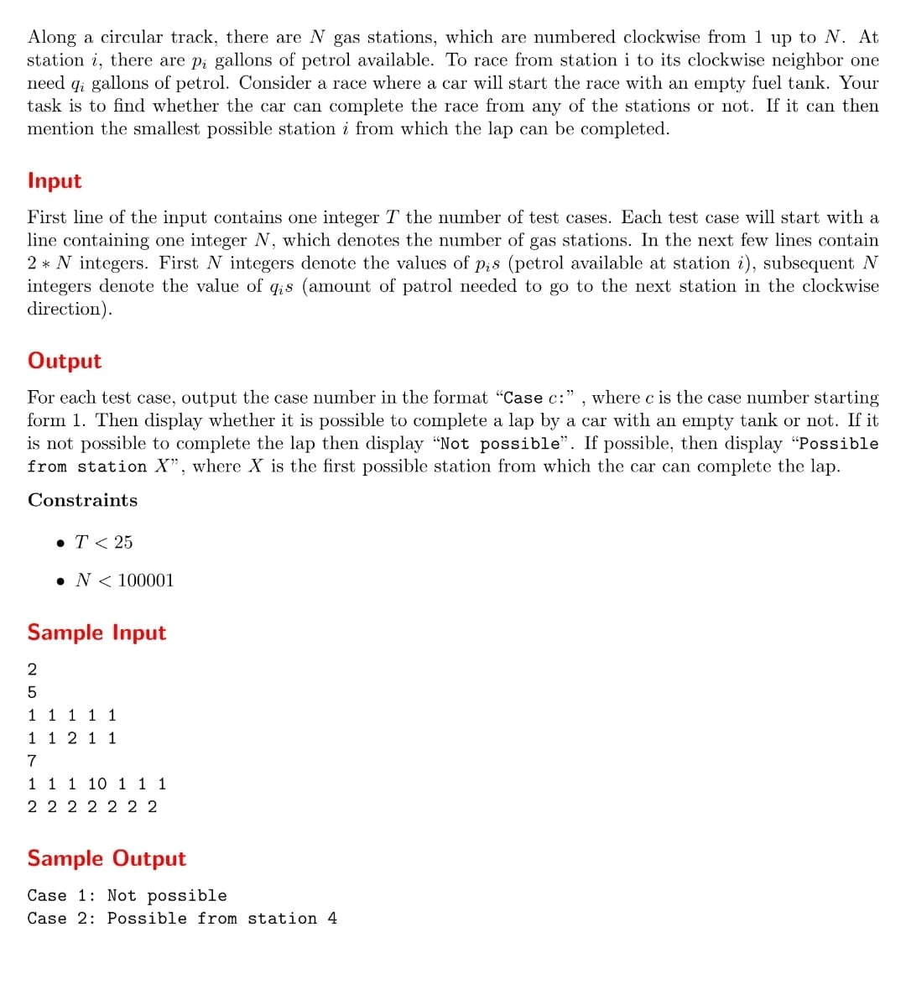

# algorithms-in-java

A set of algorithms implemented in java language.

### [Binary Search](./src/main/java/br/com/torquato/algorithms/BinarySearch.java)

* Algorithm abstraction to find an element in an array of sorted elements.
* Complexity O(log n)

### [Selection Sort](./src/main/java/br/com/torquato/algorithms/SelectionSort.java)

* Algorithm abstraction to sort an array of elements.
* Complexity O(n²)

### [Euclidean Algorithm GCD](./src/main/java/br/com/torquato/algorithms/EuclideanGCD.java)

* Algorithm abstraction to calculate the Greatest Common Divisor (GCD) of two integers A and B, the largest integer that
  divides both A and B.
* Complexity WIP

### [Quick Sort](./src/main/java/br/com/torquato/algorithms/QuickSort.java)

* Algorithm abstraction to sort an array of elements.
* Complexity O(n log(n))

### [Breadth First Search](./src/main/java/br/com/torquato/algorithms/BreadthFirstSearch.java)

* Algorithm abstraction to find the nearest vertex that satisfies a condition.
* Complexity O(V + E), where V is the number of vertices and E is the number of edges in the graph.

https://wikimedia.org/api/rest_v1/media/math/render/svg/a7cf317fbe3965ae3164f28c1f6858696adb23f4

### [Challenge Circular Track Gas Station](./src/main/java/br/com/torquato/algorithms/challenges/CircularTrackGasStations.java)

* Complexity O(n)